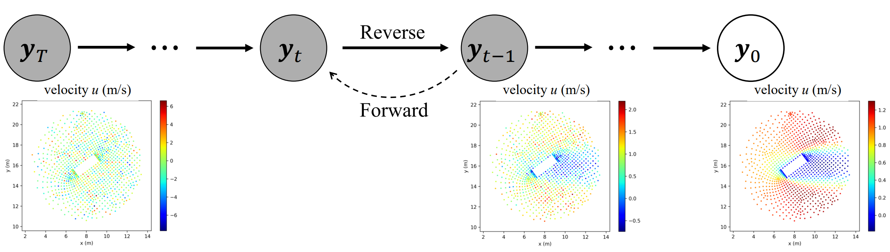
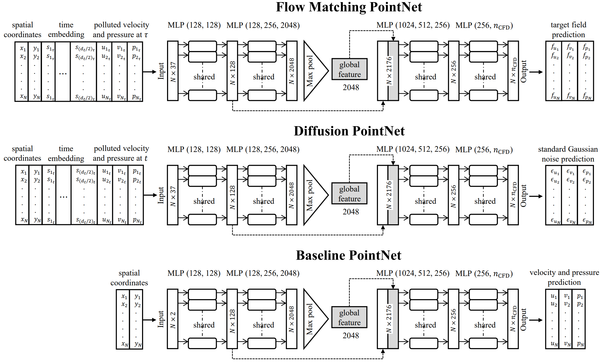

# Flow Matching PointNet and Diffusion PointNet
 <br>
<br>
 <br>

**Flow matching and diffusion models via PointNet for generating fluid fields on irregular geometries**

**Author:** Ali Kashefi (kashefi@stanford.edu) 

**Citation** <br>
If you use the code, please cite the following article: <br>

    @misc{kashefi2026FlowMatchingPointNetDiffusionPointNet,
      title={Flow Matching and Diffusion Models via PointNet for Generating Fluid Fields on Irregular Geometries}, 
      author={Ali Kashefi},
      year={2026},
      eprint={2601.03030},
      archivePrefix={arXiv},
      primaryClass={cs.CV},
      url={https://arxiv.org/abs/2601.03030}}


**Abstract** <be>

We present two novel generative geometric deep learning frameworks, termed Flow Matching PointNet and Diffusion PointNet, for predicting fluid flow variables on irregular geometries by incorporating PointNet into flow matching and diffusion models, respectively. In these frameworks, a reverse generative process reconstructs physical fields from standard Gaussian noise conditioned on unseen geometries. The proposed approaches operate directly on point-cloud representations of computational domains (e.g., grid vertices of finite-volume meshes) and therefore avoid the limitations of pixelation used to project geometries onto uniform lattices. In contrast to graph neural network–based diffusion models, Flow Matching PointNet and Diffusion PointNet do not exhibit high-frequency noise artifacts in the predicted fields. Moreover, unlike such approaches, which require auxiliary intermediate networks to condition geometry, the proposed frameworks rely solely on PointNet, resulting in a simple and unified architecture. The performance of the proposed frameworks is evaluated on steady incompressible flow past a cylinder, using a geometric dataset constructed by varying the cylinder's cross-sectional shape and orientation across samples. The results demonstrate that Flow Matching PointNet and Diffusion PointNet achieve more accurate predictions of velocity and pressure fields, as well as lift and drag forces, and exhibit greater robustness to incomplete geometries compared to a vanilla PointNet with the same number of trainable parameters.

**Installation** <be>
This guide will help you set up the environment required to run the code. Follow the steps below to install the necessary dependencies.

**Step 1: Download and Install Miniconda**

1. Visit the [Miniconda installation page](https://docs.conda.io/en/latest/miniconda.html) and download the installer that matches your operating system.
2. Follow the instructions to install Miniconda.

**Step 2: Create a Conda Environment**

After installing Miniconda, create a new environment:

```bash
conda create --name myenv python=3.8
```

Activate the environment:

```bash
conda activate myenv
```

**Step 3: Install PyTorch**

Install PyTorch with CUDA 11.8 support:

```bash
pip3 install torch torchvision torchaudio --index-url https://download.pytorch.org/whl/cu118
```

**Step 4: Install Additional Dependencies**

Install the required Python libraries:

```bash
pip3 install numpy matplotlib torchsummary
```

**Step 5: Download the Data** <be>

Use the following batch command to download the dataset (a NumPy array, approximately 42MB in size).

```bash
wget https://web.stanford.edu/~kashefi/data/CFDdata.npy
```

**Questions?** <br>
If you have any questions or need assistance, please do not hesitate to contact Ali Kashefi (kashefi@stanford.edu) via email. 

**About the Author** <br>
Please see the author's website: [Ali Kashefi](https://web.stanford.edu/~kashefi/) 
